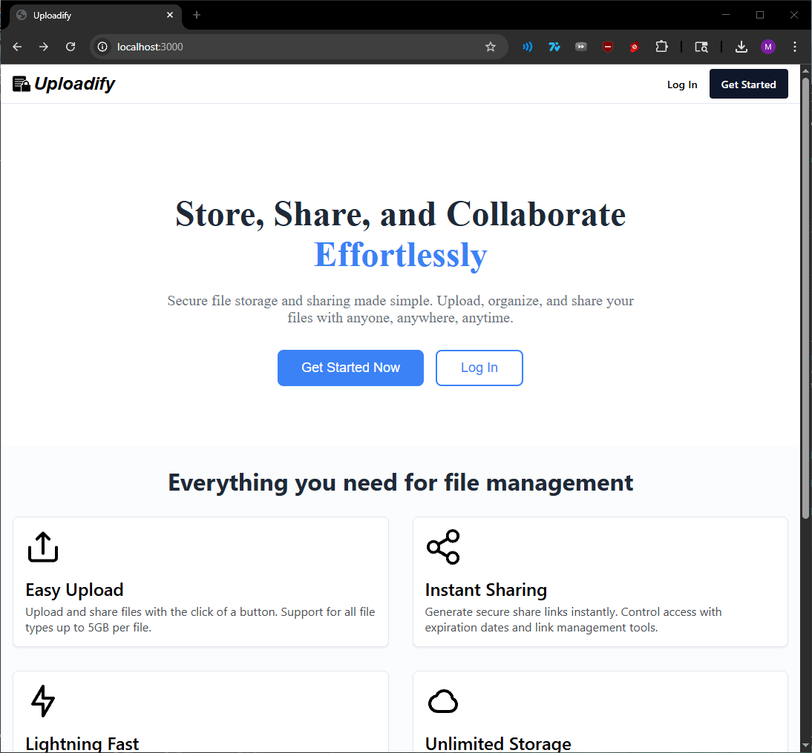
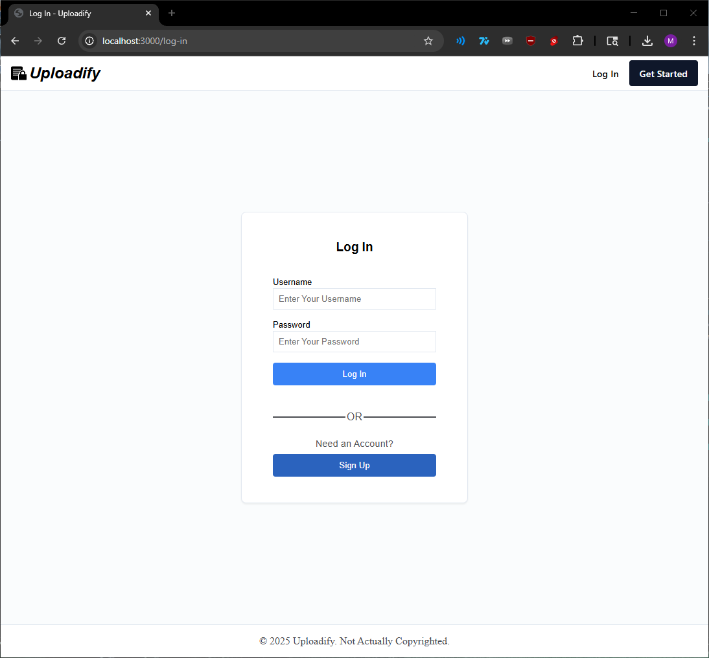
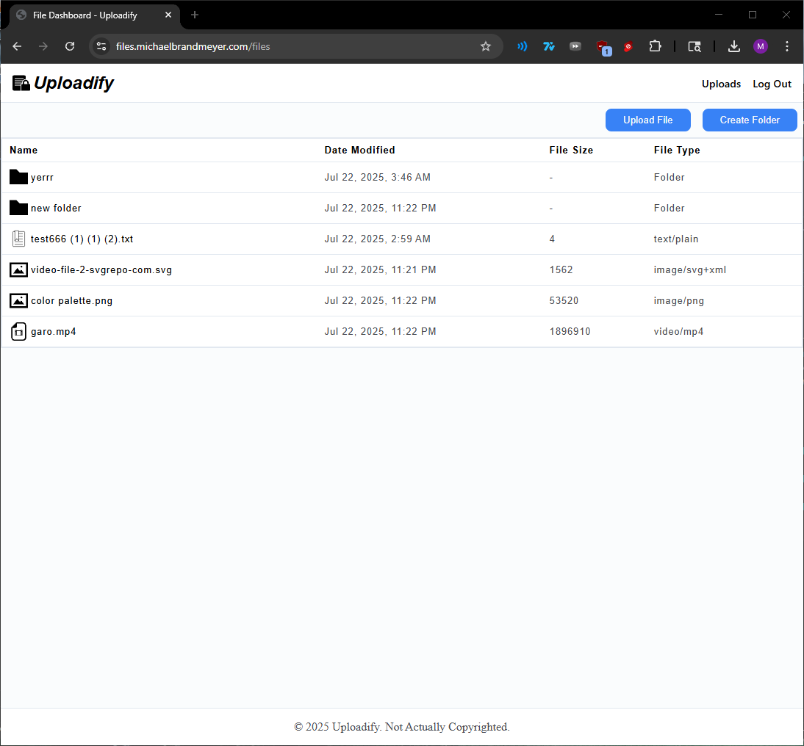
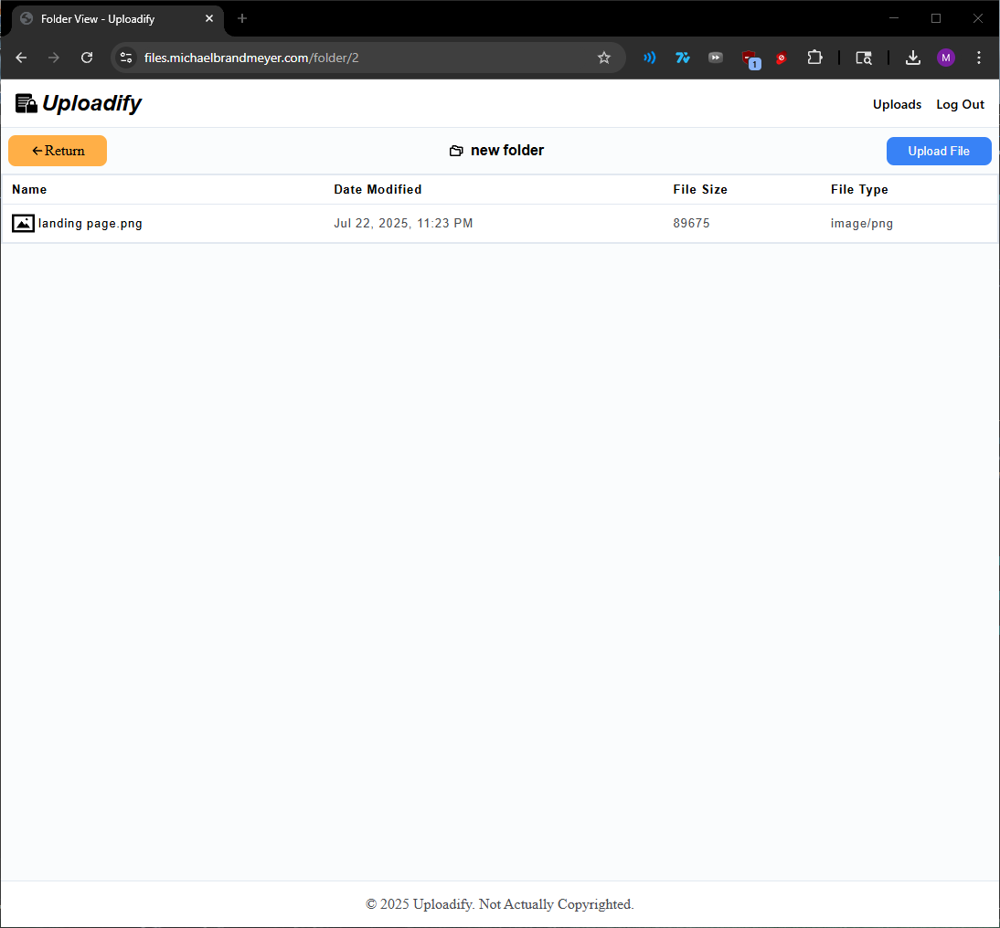
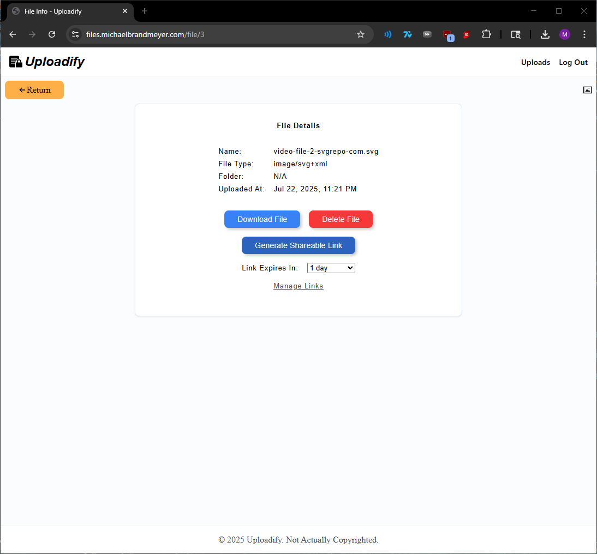
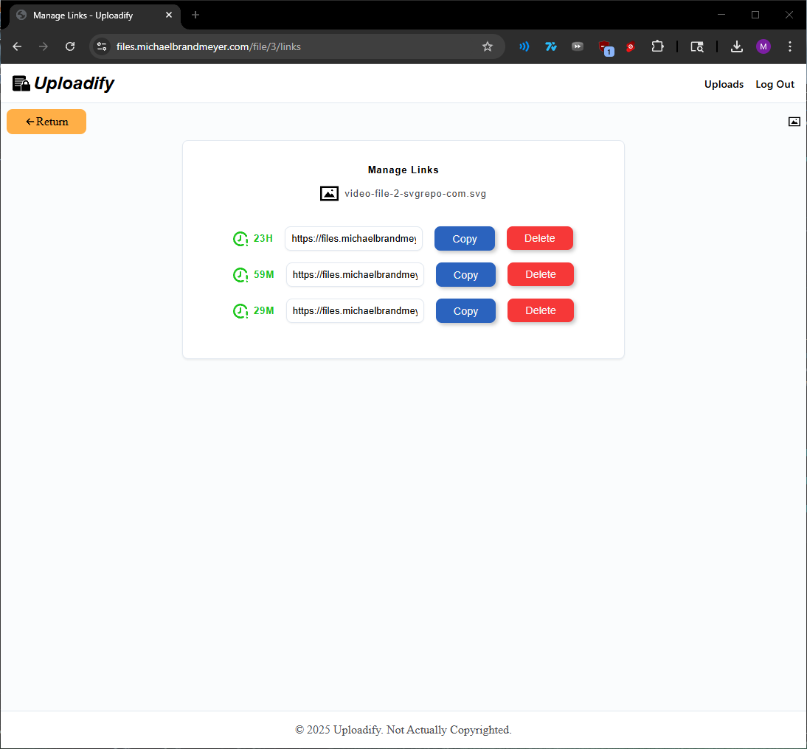
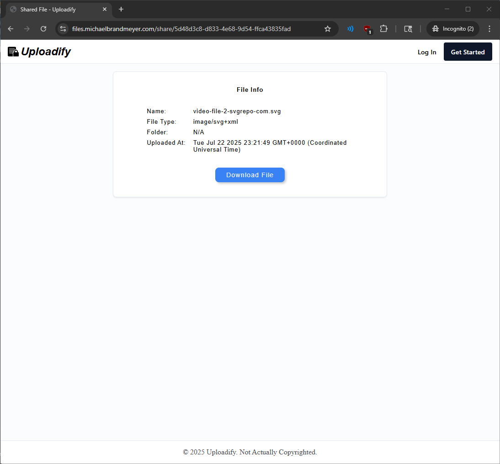

# Uploadify | File Uploading & Sharing App

**Uploadify** is a file uploading and sharing application that lets users securely upload files and manage them through a personal dashboard. Users can download, delete, and share files by generating custom links with expiration timers. Shared links can be tracked, monitored with real-time expiration timers, and revoked at any time by deleting the link.
#
This is a project I created to showcase my knowledge of web dev.

Developed and designed by: Michael Brandmeyer

Live Demo: https://files.michaelbrandmeyer.com
## Features

- ✅ Landing Page with Hero, Features list, and Call-To-Action
- ✅ Dynamic pages for a user friendly mobile and desktop experience
- ✅ User Authentication and Sessions, Log in & Sign up pages
- ✅ Add files and folders to your personal file dashboard
- ✅ Secure file storage through Supabase Storage
- ✅ Download and Manage files by clicking on a file to view the file description page
- ✅ Generate file share links with custom expiration timers
- ✅ Delete, Share, and view active links from the manage links page
- ✅ Passwords are kept safe in a postgres DB and stored as hashes
- ✅ Object-Relational Mapping through Prisma to help keep your data safe (no raw SQL)
- ✅ User/Form input validation and visual feedback

## Architecture

This Web App Follows the Model-View-Controller (MVC) software architectural pattern.

- **Model:** Business logic + Data layer via Prisma
- **View:** UI presented via EJS (HTML/CSS)
- **Controller:** 	Handles incoming requests, processes data (using models), returns a response or renders a view.
## Tech Stack

- Node.js
- Express
- EJS 
- HTML
- CSS
- PostgreSQL + Prisma
- Supabase Storage

## Roadmap

- Add Link tracking and analytics with detailed view, displaying the amount of clicks on your link, amount of unique clicks, and where your link has been shared.
## License

This project is licensed for **educational use only**. Please do not reuse or distribute the code without permission.

## Screenshots

